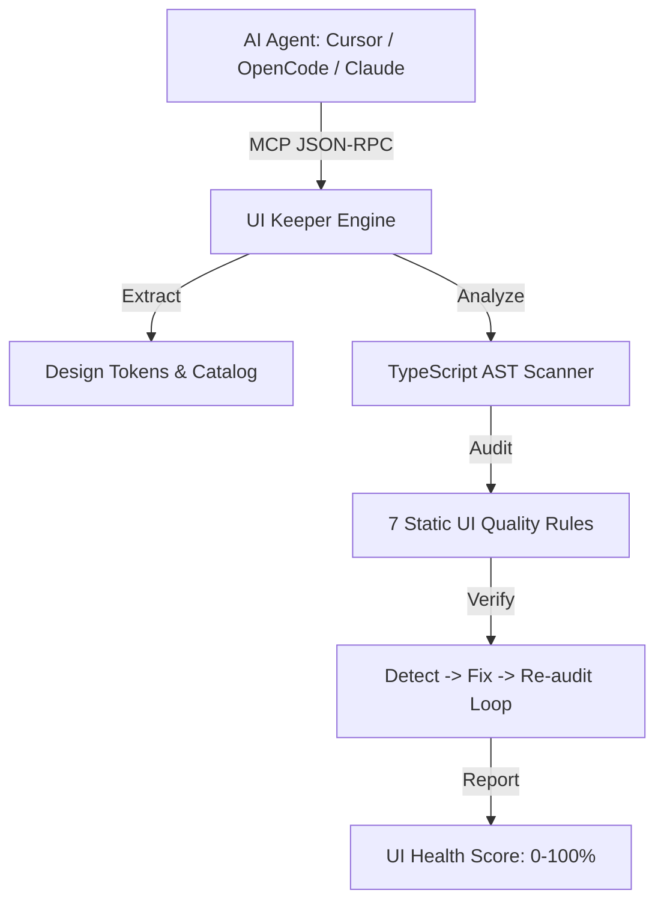

# UI Keeper

> **The local-first frontend quality and verification layer for AI coding agents (Cursor, OpenCode, Claude Code, Windsurf, Codex).**

[](https://opensource.org/licenses/MIT)
[](https://www.typescriptlang.org/)
[](https://bun.sh)
[](https://workers.cloudflare.com)

[**Read the Complete Usage & Setup Guide (USAGE.md)**](USAGE.md)

---

## What is UI Keeper?


AI coding assistants generate React and Tailwind code rapidly, but frequently introduce silent frontend quality degradation:

- **Design System Drift**: Hardcoding arbitrary colors (`#1e293b`) or off-grid pixel values (`p-[18px]`, `m-[13px]`) instead of adhering to project tokens.
- **Component Duplication & Primitive Monoliths**: Rebuilding raw primitive tags (`<button className="...">`, `<input ...>`) rather than reusing existing catalog components (e.g. `Button`, `Input`, `Dialog`).
- **Repeated Inline JSX**: Copy-pasting complex composite JSX structures (e.g., status badges or metric cards) instead of extracting reusable components.
- **Tailwind Class Bloat & Conflicts**: Adding contradictory classes (`flex block`, `text-left text-center`, `p-4 px-6`).
- **Accessibility & Contrast Violations**: Low-contrast text combinations failing WCAG 2.1 AA ($< 4.5:1$), unlabelled inputs, or missing image alt attributes.

**UI Keeper solves this** by providing a comprehensive static analysis, design token extraction, component discovery, and automated verification layer accessible via the **Model Context Protocol (MCP)** and a high-performance **CLI**.

---

## Key Capabilities



### 1. Dynamic Design Token & Theme Extractor
- Discovers and extracts tokens across CSS files (`globals.css`, `token.css`, `theme.css`).
- Full support for **Tailwind CSS v3** (`tailwind.config.ts/js`) and **Tailwind CSS v4** (`@import "tailwindcss"`, `@theme`, `@utility`, `@plugin`).
- Extracts colors (hex, rgb, hsl, oklch), 4px spacing scale, typography, radii, shadows, and breakpoints.

### 2. Component Catalog Scanner
- Scans `.tsx`/`.jsx` files across `components/`, `src/components/`, `app/components/`, `ui/`, `src/ui/`.
- Extracts exported component names, prop types, variants, and categories (`button`, `card`, `input`, `modal`, `navigation`, `layout`, `feedback`, `typography`).
- Prevents agents from reinventing already existing components.

### 3. 7 Built-in Static UI Quality Rules

| Rule ID | Name | Description |
| :--- | :--- | :--- |
| `no-hardcoded-colors` | **No Hardcoded Colors** | Flags raw hex/rgb/hsl strings and maps them to nearest design system color tokens. |
| `no-arbitrary-spacing` | **Strict 4px Spacing Grid** | Enforces the 4px base spacing scale. Converts rems, checks radii, and fixes brackets (e.g. `p-[24px]` -> `p-6`). |
| `no-duplicate-components` | **No Duplicate Components** | Detects raw primitive tags when a matching catalog component exists. |
| `no-repeated-inline-jsx` | **Repeated JSX Detector** | Identifies identical monolithic JSX structural patterns repeated 2+ times and recommends extraction. |
| `no-conflicting-classes` | **Class Conflict Optimizer** | Detects contradictory Tailwind layout, typography, or spacing classes and prunes redundancy. |
| `wcag-contrast-ratio` | **WCAG Contrast Checker** | Calculates static relative luminance and flags contrast ratios failing WCAG AA ($< 4.5:1$). |
| `no-rebuilding-library-components` | **Library Component Guard** | Prevents building custom modal/dialog/sheet code when libraries like `shadcn/ui` or `@radix-ui` are present. |

### 4. Auto-Fix with Verification Loop
Applies automated fixes and immediately verifies them:
1. **Detect**: Audits the file and records baseline issue count.
2. **Fix**: Applies high-confidence token substitutions and class optimizations.
3. **Re-audit**: Re-analyzes the modified file.
4. **Decision**: Keeps changes only if total issues decrease; automatically reverts on regression.

### 5. UI Health Score (0-100%) & Letter Grade
Calculates a weighted UI Health Score:
- **Token Adoption (35%)**: Adherence to colors, radii, and 4px spacing grid.
- **Component Reuse (35%)**: Catalog usage and absence of monolithic JSX duplicates.
- **Code Cleanliness (30%)**: Absence of class conflicts and WCAG contrast violations.
- Outputs an overall score with letter grade (`A+`, `A`, `B`, `C`, `D`, `F`) and actionable recommendations.

---

## Available MCP Tools

UI Keeper exposes **10 standardized MCP tools** compatible with any MCP client:

| Tool Name | Scope | Description | Key Parameters |
| :--- | :--- | :--- | :--- |
| **`inspect_design_system`** | Local / Project | Extracts design tokens (colors, spacing, typography, radius, shadows, breakpoints). | `rootDir?: string` |
| **`inspect_ui`** | Local / Project | Returns complete project UI model (framework, styling engine, tokens, catalog, routes). | `rootDir?: string` |
| **`audit_ui`** | Local / Project | Audits target files/directories against design system rules with issue locations and fixes. | `rootDir?: string`, `targetPath?: string` |
| **`audit_code`** | Edge / Remote | Audits raw TSX/JSX source code directly without requiring local disk access. | `code: string`, `filePath?: string`, `cssContent?: string` |
| **`extract_tokens_from_css`** | Edge / Remote | Parses tokens directly from raw CSS string content (e.g. from `token.css`). | `cssContent: string` |
| **`get_ui_health_score`** | Local / Project | Returns comprehensive 0-100% UI health score, letter grade, and recommendations. | `rootDir?: string`, `targetPath?: string` |
| **`scaffold_component`** | Any | Generates production-ready, typed, token-compliant React component code. | `name: string`, `category?: string`, `writeToFile?: boolean` |
| **`find_component`** | Local / Project | Searches existing catalog components by keyword or category to avoid duplicate code. | `query: string`, `category?: string` |
| **`find_design_token`** | Any | Finds the exact or closest matching design token for a given color or spacing value. | `type: "color" \| "spacing" \| "radius"`, `value: string` |
| **`apply_ui_fix`** | Local / Project | Applies automated fixes and verifies improvement using the verification loop. | `rootDir?: string`, `targetPath?: string` |

---

## Monorepo Architecture

The repository is structured as a modular TypeScript monorepo:

```
ui-keeper/
├── packages/
│   ├── core/           # @ui-keeper/core (Domain schemas, AST scanners, token parsers, 7 audit rules, auto-fix loop)
│   ├── cli/            # @ui-keeper/cli (Command-line tool: init, analyze, audit, fix, score, generate, hook)
│   └── local-mcp/      # @ui-keeper/local-mcp (Local Stdio MCP server for direct filesystem access)
└── apps/
    └── remote-mcp/     # @ui-keeper/remote-mcp (Cloudflare Workers edge MCP server built with Hono)
```

---

## Getting Started & Usage

For full step-by-step installation, client configuration (OpenCode, Cursor, Claude, Windsurf), CLI references, and Git pre-commit hook setups, read **[USAGE.md](file:///Users/pankaj/Developer/projects/ui-keeper/USAGE.md)**.
